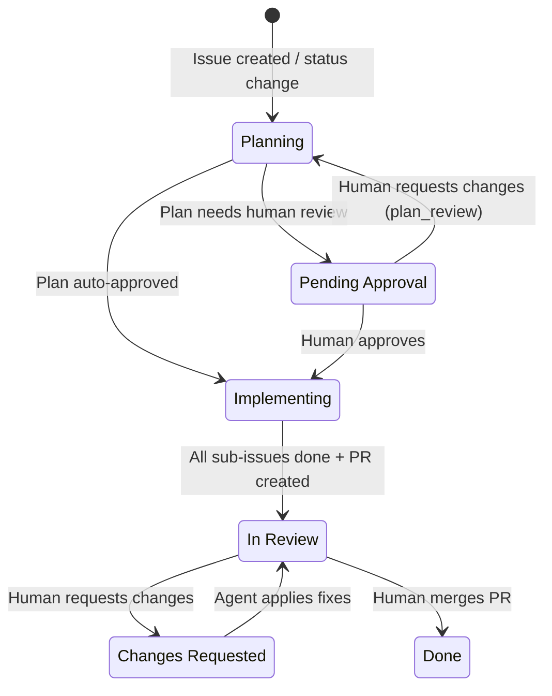

# Loki

Linear-driven AI agent. Automatically plans and implements tasks triggered by issue status changes.

## Structure

- `config/` — Configuration + constants
  - `__init__.py` — Config loading, repo resolution
  - `constants.py` — State/phase constants
- `lib/` — External tool integrations
  - `linear.py` — Linear GraphQL client + Agent API
  - `claude.py` — Claude CLI execution, sandbox settings
  - `git.py` — git/gh subprocess wrappers
- `forge/` — Backend (polling daemon)
  - `__main__.py` — Entry point (`python -m forge`)
  - `orchestrator.py` — Polling, dispatch, lock lifecycle
  - `executor.py` — Per-issue execution (prompt, worktree, post-processing)
  - `pr_creator.py` — PR body generation and GitHub PR creation
  - `queue.py` — File-based queue for async dispatch (enqueue/dequeue/wake)
- `agent/` — Sleipnir: webhook server (frontend)
  - `__main__.py` — Entry point (`python -m agent`)
  - `webhook.py` — Linear Agent API webhook
- `bin/` — Shell scripts (`forge.sh`, `sleipnir.sh`, `service-systemd.sh`, `service-launchd.sh`)
- `scripts/` — Utility scripts (`check_cycle.py`)
- `prompts/` — Prompt templates for each phase
- `config/settings.json` — Configuration values (git ignored, do NOT commit)
- `config/secrets.env` — Credentials (git ignored, do NOT commit)
- `config/repos.conf` — Label → repository path mapping (git ignored, do NOT commit)

## Flow

1. Planning: Parent issue → code investigation → plan creation → self-review → auto-approve or Pending Approval
2. Plan Review: Pending Approval ⇄ Planning (human feedback → plan revision → auto-approve or Pending Approval)
3. Sub-issue Creation: Implementing (no sub-issues) → plan to sub-issues → dependency setup → Implementing
4. Implementing: Parent issue → sub-issue dependency resolution → worktree isolation → conductor pattern (implementer + reviewer) → PR → In Review
5. Review: Changes Requested → fix based on PR review comments → In Review

Webhook → `queue.enqueue()` → SIGUSR1 wake → orchestrator picks up queued items on next cycle.

See `ARCHITECTURE.md` for detailed technical documentation.

## Conventions

- Commit messages and PR titles/descriptions must be written in English.
